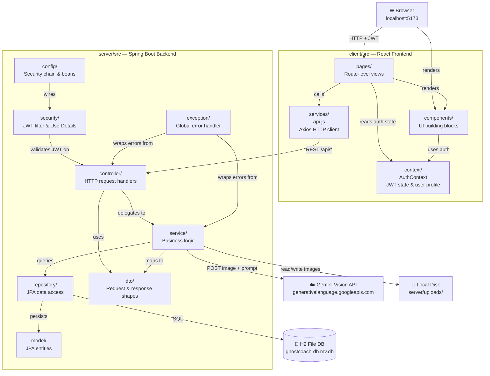
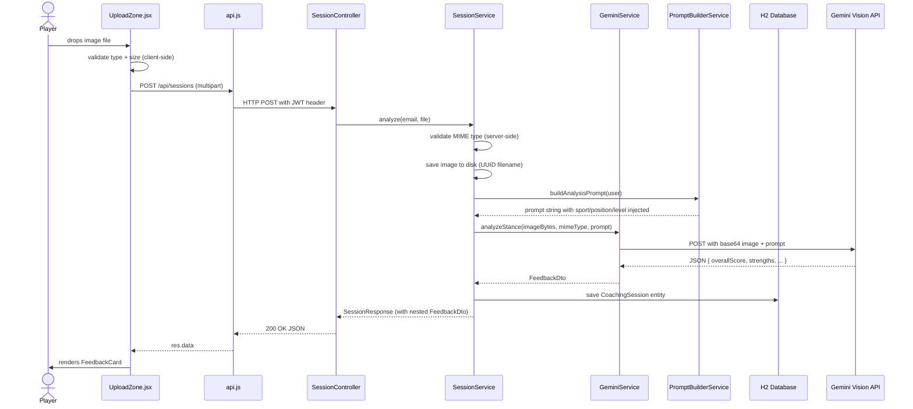
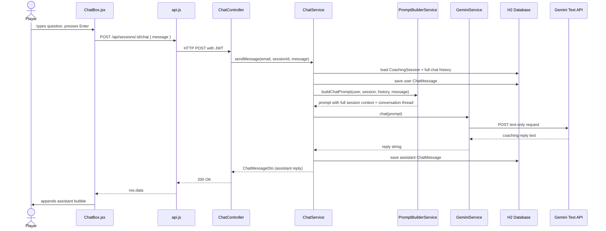
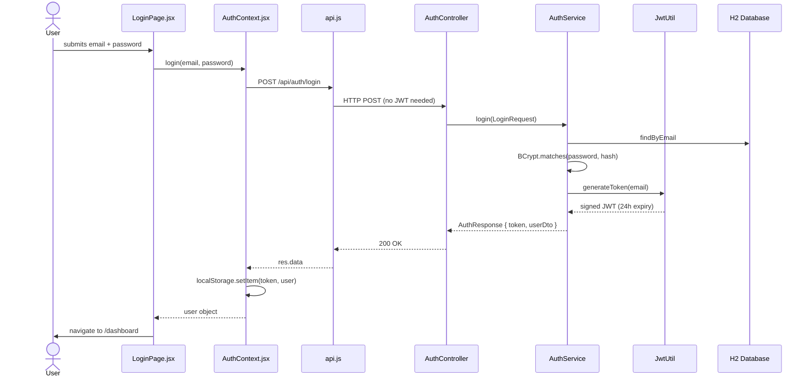

# Ghost Coach — Knowledge Graph

Visual map of every directory, its purpose, and how it connects to the rest of the system.

---

## Full System Overview



---

## Directory Reference

### Frontend — `client/src/`

| Directory | Role | Key Files | Talks To |
|---|---|---|---|
| `context/` | Global auth state — stores the JWT token and decoded user profile. Single source of truth for "who is logged in." | `AuthContext.jsx` | `services/api.js` (for login/register calls), all `pages/` |
| `services/` | Thin HTTP layer — wraps every backend endpoint in a named function. Attaches the JWT to every request automatically via an Axios interceptor. Redirects to `/login` on 401. | `api.js` | Backend `/api/*` routes |
| `components/` | Reusable, stateless UI blocks. Each component receives data as props and emits events up. No direct API calls. | `FeedbackCard`, `SessionCard`, `UploadZone`, `ChatBox`, `Navbar`, `ProtectedRoute` | `context/` (Navbar reads user), `services/` (ChatBox calls chat API) |
| `pages/` | Route-level smart components. Own their data-fetching `useEffect` hooks and loading/error states. Compose components to build the full view. | `DashboardPage`, `HistoryPage`, `SessionPage`, `ProgressPage`, `LoginPage`, `RegisterPage` | `context/`, `services/`, `components/` |

---

### Backend — `server/src/main/java/com/ghostcoach/`

| Directory | Role | Key Files | Talks To |
|---|---|---|---|
| `model/` | JPA entity definitions — the canonical schema of the database. Hibernate uses these to auto-create and migrate tables. | `User`, `CoachingSession`, `ChatMessage` | `repository/` (persisted via Spring Data) |
| `repository/` | Spring Data JPA interfaces — declare queries as method signatures, Spring generates the SQL. No implementation code needed. | `UserRepository`, `CoachingSessionRepository`, `ChatMessageRepository` | `model/` (entity types), `service/` (called by services) |
| `dto/` | Data transfer objects — define what the API accepts and returns. Decouples the HTTP contract from the internal entity shape. Prevents leaking password hashes or internal IDs. | `RegisterRequest`, `LoginRequest`, `AuthResponse`, `FeedbackDto`, `SessionResponse`, `ChatMessageDto` | `controller/` (request binding), `service/` (response building) |
| `service/` | All business logic lives here. Controllers are kept thin — they delegate immediately. Services call repositories, call Gemini, serialize JSON, enforce ownership. | `AuthService`, `SessionService`, `GeminiService`, `PromptBuilderService`, `ChatService` | `repository/`, `dto/`, external Gemini API, local filesystem |
| `controller/` | HTTP entry points only. Deserialize the request, call a service, return the DTO. No business logic, no direct repository access. | `AuthController`, `SessionController`, `ChatController` | `service/`, `dto/` |
| `security/` | JWT machinery — token generation, validation, and injection into Spring Security's context. Runs as a filter before every request. | `JwtUtil`, `JwtAuthFilter`, `UserDetailsServiceImpl` | `repository/` (loads user by email) |
| `config/` | Spring wiring — defines the security filter chain, CORS policy, and shared beans (RestTemplate, ObjectMapper). | `SecurityConfig`, `AppConfig` | `security/` |
| `exception/` | Single `@RestControllerAdvice` that catches all thrown exceptions and maps them to consistent JSON error responses with correct HTTP status codes. | `GlobalExceptionHandler`, `ApiException` | Wraps all layers |

---

## Data Flow Diagrams

### Feature 2: Stance Upload & AI Feedback



### Feature 4: AI Improvement Chat



### Auth Flow



---

## Dependency Map

```mermaid
graph LR
    subgraph External
        Gemini["Gemini 1.5 Flash API"]
        H2["H2 Database"]
        FS["Local Filesystem"]
    end

    subgraph Spring Boot
        GeminiSvc["GeminiService"] --> Gemini
        SessionSvc["SessionService"] --> FS
        Repos["Repositories"] --> H2
        JwtUtil["JwtUtil"] -->|HS256 signing| JWT["JWT Standard"]
    end

    subgraph React
        Axios["api.js (Axios)"] -->|proxied by Vite| Spring Boot
        localStorage -->|token persisted| Axios
    end
```
